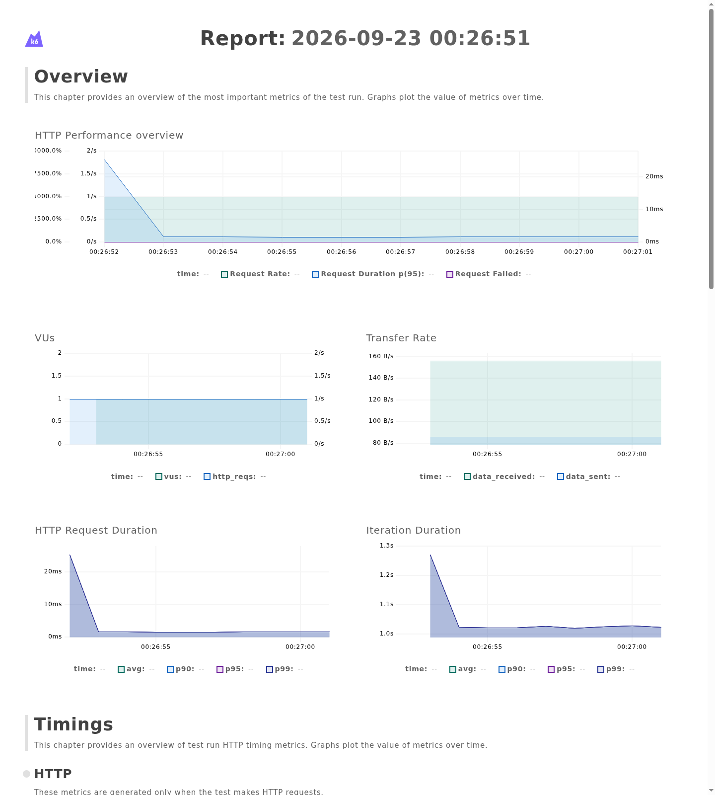
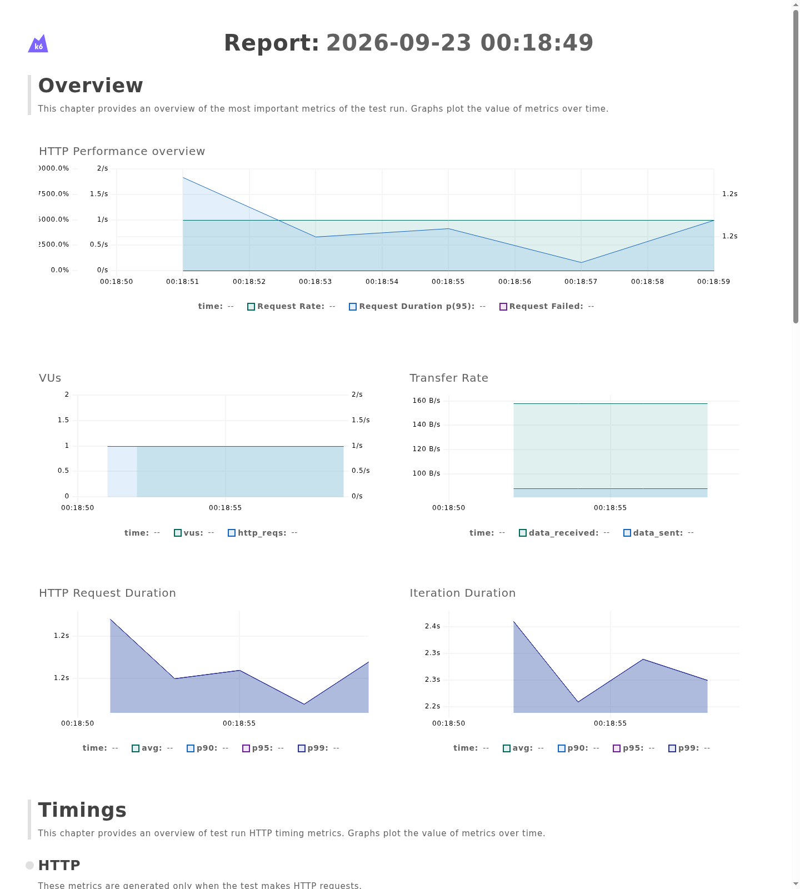

# Performance Regression Gate

Proyecto de QA orientado a detectar regresiones de rendimiento mediante pruebas automatizadas con **k6**.

La aplicación utiliza un pequeño servicio desarrollado con **FastAPI** que puede ejecutarse en modo normal o degradado. k6 mide su comportamiento y aplica distintos thresholds para decidir automáticamente si el rendimiento es aceptable.

## Objetivo

El proyecto demuestra que una aplicación puede seguir funcionando correctamente a nivel funcional y, aun así, sufrir una regresión importante de rendimiento.

Actualmente, el quality gate comprueba:

- p95 de latencia inferior a 500 ms.
- tasa de peticiones fallidas inferior al 1 %.
- más del 99 % de checks correctos.

Si alguno de estos límites se incumple, k6 marca la ejecución como fallida.

## Escenarios

### Normal

La API responde sin introducir retrasos artificiales.

```bash
MODE=normal k6 run k6/smoke.js
```

Resultado obtenido:

- p95: ~15 ms
- errores HTTP: 0 %
- checks correctos: 100 %
- Quality gate: **PASS**



### Degraded

La API introduce aproximadamente un segundo de latencia artificial.

```bash
MODE=degraded k6 run k6/smoke.js
```

Resultado obtenido:

- p95: ~1 s
- respuestas HTTP: 200
- checks correctos: 100 %
- regresión de rendimiento detectada
- Quality gate: **FAIL**



## Cómo funciona

```text
FastAPI
   │
   ▼
/work?mode=normal
/work?mode=degraded
   │
   ▼
k6
   │
   ▼
Performance thresholds
   │
   ├── PASS
   └── FAIL
```

El endpoint `/health` permite comprobar que la API está disponible.

El endpoint `/work` es el sistema bajo prueba:

- `mode=normal` responde normalmente.
- `mode=degraded` introduce un retraso artificial para simular una regresión.

k6 ejecuta peticiones contra ese endpoint y evalúa automáticamente los thresholds definidos.

## Quality Gate

Los límites actuales son:

```javascript
thresholds: {
  http_req_duration: ['p(95)<500'],
  http_req_failed: ['rate<0.01'],
  checks: ['rate>0.99'],
}
```

Esto significa que:

- el 95 % de las peticiones debe responder en menos de 500 ms;
- menos del 1 % de las peticiones puede fallar;
- más del 99 % de los checks debe completarse correctamente.

## Estructura

```text
performance-regression-gate/
├── api/
│   ├── app.py
│   └── requirements.txt
├── k6/
│   └── smoke.js
├── docs/
│   └── images/
│       ├── k6-threshold-pass.png
│       └── k6-threshold-fail.png
├── reports/
├── .github/
│   └── workflows/
├── .gitignore
└── README.md
```

## Ejecución local

Crear y activar el entorno virtual:

```bash
python3 -m venv .venv
source .venv/bin/activate
pip install -r api/requirements.txt
```

Levantar la API:

```bash
uvicorn api.app:app --reload
```

Ejecutar el escenario normal:

```bash
MODE=normal k6 run k6/smoke.js
```

Ejecutar el escenario degradado:

```bash
MODE=degraded k6 run k6/smoke.js
```

## Estado del proyecto

Actualmente están implementados:

- API mínima con FastAPI.
- Endpoint de health check.
- Escenario normal.
- Escenario degradado.
- Smoke test con k6.
- Quality gate basado en latencia, errores y checks.
- Informes visuales de ejecuciones PASS y FAIL.

## Próximos pasos

- Añadir escenarios de carga y estrés.
- Contenerizar la aplicación con Docker.
- Integrar el quality gate con GitHub Actions.
- Permitir ejecutar la demo directamente desde GitHub.
